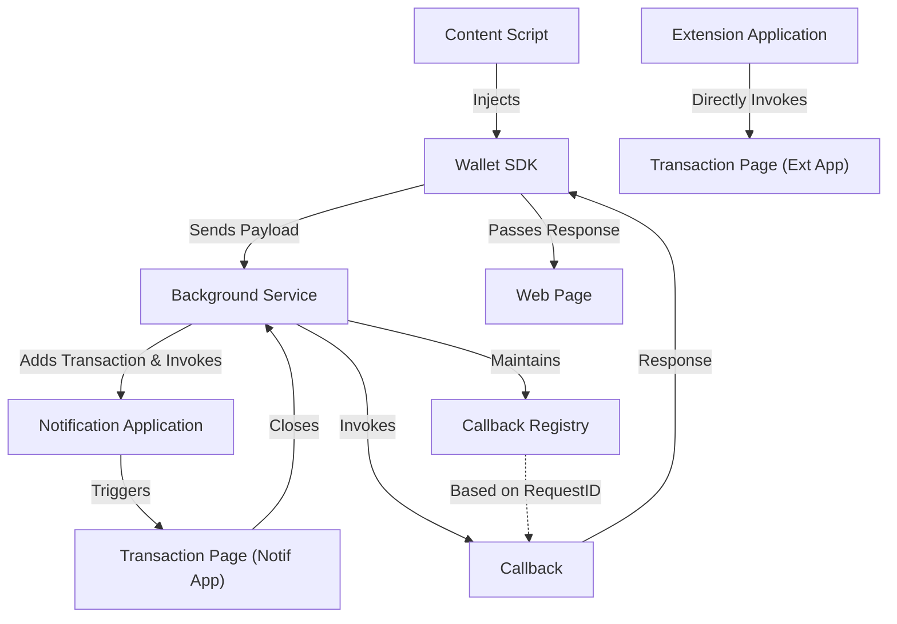

```mermaid
graph TD
    ContentScript["Content Script"]
    WalletSDK["Wallet SDK"]
    BackgroundService["Background Service"]
    NotificationApp["Notification Application"]
    TransactionPageNotif["Transaction Page (Notif App)"]
    TransactionPageExt["Transaction Page (Ext App)"]
    ExtensionApp["Extension Application"]
    CallbackRegistry["Callback Registry"]
    Callback["Callback"]
    WebPage["Web Page"]

    ContentScript --> |Injects| WalletSDK
    WalletSDK --> |Sends Payload| BackgroundService
    BackgroundService --> |Adds Transaction & Invokes| NotificationApp
    BackgroundService --> |Maintains| CallbackRegistry
    NotificationApp --> |Triggers| TransactionPageNotif
    TransactionPageNotif --> |Closes| BackgroundService
    BackgroundService --> |Invokes| Callback
    CallbackRegistry -.-> |Based on RequestID| Callback
    ExtensionApp --> |Directly Invokes| TransactionPageExt
    Callback --> |Response| WalletSDK
    WalletSDK --> |Passes Response| WebPage

```
